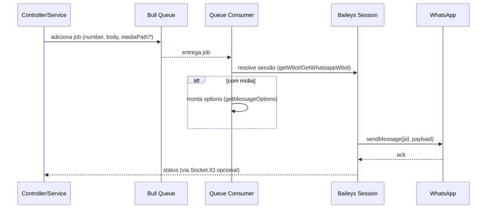

# Documentação do Backend (Express + TypeScript)

## Visão geral da arquitetura

- Camadas e diretórios principais em `src/`:
  - Configurações: [`config/`](file:///c:/Code/codatendechat-mainatualizado/codatendechat-main/backend/src/config)
    - Banco de dados: [`config/database.ts`](file:///c:/Code/codatendechat-mainatualizado/codatendechat-main/backend/src/config/database.ts#L1-L41)
    - Auth/JWT: [`config/auth.ts`](file:///c:/Code/codatendechat-mainatualizado/codatendechat-main/backend/src/config/auth.ts#L1-L6)
  - Inicialização: [`bootstrap.ts`](file:///c:/Code/codatendechat-mainatualizado/codatendechat-main/backend/src/bootstrap.ts#L1-L5) carrega variáveis `.env`.
  - Aplicação Express: [`app.ts`](file:///c:/Code/codatendechat-mainatualizado/codatendechat-main/backend/src/app.ts#L1-L53)
  - Servidor/entrada: [`server.ts`](file:///c:/Code/codatendechat-mainatualizado/codatendechat-main/backend/src/server.ts#L1-L40)
  - Rotas: [`routes/`](file:///c:/Code/codatendechat-mainatualizado/codatendechat-main/backend/src/routes) e agregador [`routes/index.ts`](file:///c:/Code/codatendechat-mainatualizado/codatendechat-main/backend/src/routes/index.ts#L1-L76)
  - Controllers: [`controllers/`](file:///c:/Code/codatendechat-mainatualizado/codatendechat-main/backend/src/controllers)
  - Serviços (regras de negócio): [`services/`](file:///c:/Code/codatendechat-mainatualizado/codatendechat-main/backend/src/services)
  - Modelos (ORM): [`models/`](file:///c:/Code/codatendechat-mainatualizado/codatendechat-main/backend/src/models) registrados em [`database/index.ts`](file:///c:/Code/codatendechat-mainatualizado/codatendechat-main/backend/src/database/index.ts#L50-L100)
  - Banco de dados: [`database/`](file:///c:/Code/codatendechat-mainatualizado/codatendechat-main/backend/src/database)
  - Middlewares: [`middleware/`](file:///c:/Code/codatendechat-mainatualizado/codatendechat-main/backend/src/middleware)
  - Utilitários e helpers: [`utils/`](file:///c:/Code/codatendechat-mainatualizado/codatendechat-main/backend/src/utils), [`helpers/`](file:///c:/Code/codatendechat-mainatualizado/codatendechat-main/backend/src/helpers)
  - Integrações: websockets em [`libs/socket.ts`](file:///c:/Code/codatendechat-mainatualizado/codatendechat-main/backend/src/libs/socket.ts#L14-L175) e WhatsApp via Baileys em [`libs/wbot.ts`](file:///c:/Code/codatendechat-mainatualizado/codatendechat-main/backend/src/libs/wbot.ts#L1-L263)
  - Filas e agendamentos: [`queues.ts`](file:///c:/Code/codatendechat-mainatualizado/codatendechat-main/backend/src/queues.ts#L1-L1000)

- Convenções TypeScript/ORM:
  - Decorators do `sequelize-typescript` em modelos, p.ex.: [`User`](file:///c:/Code/codatendechat-mainatualizado/codatendechat-main/backend/src/models/User.ts#L26-L106), [`Ticket`](file:///c:/Code/codatendechat-mainatualizado/codatendechat-main/backend/src/models/Ticket.ts#L31-L167).
  - Augment de tipos do Express adiciona `req.user`: [`@types/express.d.ts`](file:///c:/Code/codatendechat-mainatualizado/codatendechat-main/backend/src/@types/express.d.ts#L1-L4).

## Fluxo principal da aplicação

- Bootstrap e configuração
  - Carrega `.env`: [`bootstrap.ts`](file:///c:/Code/codatendechat-mainatualizado/codatendechat-main/backend/src/bootstrap.ts#L1-L5).
  - Inicializa Sentry, middlewares e rotas: [`app.ts`](file:///c:/Code/codatendechat-mainatualizado/codatendechat-main/backend/src/app.ts#L17-L41).

- Inicialização do servidor
  - Sobe HTTP e abre sessões de WhatsApp para todas as empresas, inicia processadores de filas, cron de transferência e WebSocket:
    - Servidor: [`server.ts`](file:///c:/Code/codatendechat-mainatualizado/codatendechat-main/backend/src/server.ts#L11-L23)
    - Agendamento de transferência: [`server.ts`](file:///c:/Code/codatendechat-mainatualizado/codatendechat-main/backend/src/server.ts#L25-L37)
    - Socket.IO: [`server.ts`](file:///c:/Code/codatendechat-mainatualizado/codatendechat-main/backend/src/server.ts#L39-L40) e implementação em [`libs/socket.ts`](file:///c:/Code/codatendechat-mainatualizado/codatendechat-main/backend/src/libs/socket.ts#L14-L175)

- Ciclo de requisição HTTP (Express)
  - Middlewares base: CORS, cookies, parse de JSON, Sentry: [`app.ts`](file:///c:/Code/codatendechat-mainatualizado/codatendechat-main/backend/src/app.ts#L29-L38).
  - Assets estáticos em `/public`: [`app.ts`](file:///c:/Code/codatendechat-mainatualizado/codatendechat-main/backend/src/app.ts#L38-L38).
  - Encaminhamento para rotas: [`app.ts`](file:///c:/Code/codatendechat-mainatualizado/codatendechat-main/backend/src/app.ts#L39-L39) e agregação em [`routes/index.ts`](file:///c:/Code/codatendechat-mainatualizado/codatendechat-main/backend/src/routes/index.ts#L39-L75).
  - Tratamento centralizado de erros `AppError` e 500: [`app.ts`](file:///c:/Code/codatendechat-mainatualizado/codatendechat-main/backend/src/app.ts#L41-L51).

- Autenticação e autorização
  - JWT lido de `Authorization: Bearer <token>` e decodificado em middleware: [`isAuth`](file:///c:/Code/codatendechat-mainatualizado/codatendechat-main/backend/src/middleware/isAuth.ts#L16-L38). Dados são colocados em `req.user` (tipado em [`@types/express.d.ts`](file:///c:/Code/codatendechat-mainatualizado/codatendechat-main/backend/src/@types/express.d.ts#L1-L4)).
  - Segredos e expiração: [`config/auth.ts`](file:///c:/Code/codatendechat-mainatualizado/codatendechat-main/backend/src/config/auth.ts#L1-L6).

- WebSocket (tempo real)
  - Conexão com validação de token e associação a salas por empresa, usuário, fila e status: [`libs/socket.ts`](file:///c:/Code/codatendechat-mainatualizado/codatendechat-main/backend/src/libs/socket.ts#L26-L75).
  - Canais principais: `company-<id>-mainchannel`, `user-<id>`, notificações por fila e tickets pendentes: [`libs/socket.ts`](file:///c:/Code/codatendechat-mainatualizado/codatendechat-main/backend/src/libs/socket.ts#L99-L170).

- Filas e jobs
  - Definição de filas Bull e monitores: [`queues.ts`](file:///c:/Code/codatendechat-mainatualizado/codatendechat-main/backend/src/queues.ts#L56-L74).
  - Processadores de mensagens, agendamentos, campanhas, status de login, geração de boletos e fechamento automático de tickets: ver funções em [`queues.ts`](file:///c:/Code/codatendechat-mainatualizado/codatendechat-main/backend/src/queues.ts#L199-L216), [`queues.ts`](file:///c:/Code/codatendechat-mainatualizado/codatendechat-main/backend/src/queues.ts#L218-L249), [`queues.ts`](file:///c:/Code/codatendechat-mainatualizado/codatendechat-main/backend/src/queues.ts#L295-L337), [`queues.ts`](file:///c:/Code/codatendechat-mainatualizado/codatendechat-main/backend/src/queues.ts#L811-L825), [`queues.ts`](file:///c:/Code/codatendechat-mainatualizado/codatendechat-main/backend/src/queues.ts#L828-L901) e registro em [`startQueueProcess`](file:///c:/Code/codatendechat-mainatualizado/codatendechat-main/backend/src/queues.ts#L907-L1000).

- Integração WhatsApp (Baileys)
  - Gerencia sessões, reconexão, QRCode, alteração de status e emissão de eventos: [`libs/wbot.ts`](file:///c:/Code/codatendechat-mainatualizado/codatendechat-main/backend/src/libs/wbot.ts#L147-L210) e [`libs/wbot.ts`](file:///c:/Code/codatendechat-mainatualizado/codatendechat-main/backend/src/libs/wbot.ts#L212-L251).

## Principais dependências e usos

- Web/API
  - `express`: servidor HTTP e roteamento.
  - `express-async-errors`: captura exceções em rotas assíncronas.
  - `cors`, `cookie-parser`, `body-parser` e `express.json` para parsing e CORS.
  - `@sentry/node`: rastreamento de erros.

- Autenticação e segurança
  - `jsonwebtoken` para JWT; ver [`isAuth`](file:///c:/Code/codatendechat-mainatualizado/codatendechat-main/backend/src/middleware/isAuth.ts#L16-L38).
  - `bcryptjs` para hash de senha; hooks em [`User.hashPassword`](file:///c:/Code/codatendechat-mainatualizado/codatendechat-main/backend/src/models/User.ts#L95-L101).

- ORM e banco de dados
  - `sequelize`, `sequelize-typescript` com aliases decorados; conexão em [`database/index.ts`](file:///c:/Code/codatendechat-mainatualizado/codatendechat-main/backend/src/database/index.ts#L50-L98) e config em [`config/database.ts`](file:///c:/Code/codatendechat-mainatualizado/codatendechat-main/backend/src/config/database.ts#L3-L41).
  - Dialects suportados por env (`mysql2` e `pg`).

- Filas, agendamentos e cache
  - `bull` com Redis (`REDIS_URI`) para filas: [`queues.ts`](file:///c:/Code/codatendechat-mainatualizado/codatendechat-main/backend/src/queues.ts#L56-L74).
  - `cron` e `node-cron` para jobs periódicos.
  - `node-cache` para caches leves.

- Tempo real e logs
  - `socket.io` para WebSocket: [`libs/socket.ts`](file:///c:/Code/codatendechat-mainatualizado/codatendechat-main/backend/src/libs/socket.ts#L14-L25).
  - `pino` e `pino-pretty` para log estruturado: [`utils/logger.ts`](file:///c:/Code/codatendechat-mainatualizado/codatendechat-main/backend/src/utils/logger.ts#L1-L14).

- Uploads e mídias
  - `multer` e `mime-types`, `fluent-ffmpeg` + `@ffmpeg-installer/ffmpeg` para processamento de mídia.

- Integrações
  - WhatsApp com `baileys` e `@adiwajshing/keyed-db`: [`libs/wbot.ts`](file:///c:/Code/codatendechat-mainatualizado/codatendechat-main/backend/src/libs/wbot.ts#L67-L114).
  - Faturamento/Pagamentos: `gn-api-sdk-typescript` (Gerencianet).
  - E-mail: `nodemailer`.
  - Automação: `puppeteer`.
  - IA: `openai`.

- Utilidades
  - `date-fns`, `uuid`, `yup`, `mustache`, `dotenv`.

Observação: o código utiliza `moment` extensivamente em [`queues.ts`](file:///c:/Code/codatendechat-mainatualizado/codatendechat-main/backend/src/queues.ts#L301-L337) e outros pontos, mas a dependência `moment` não está listada em `package.json`. Verificar e alinhar (adicionar `moment` ou migrar para `date-fns`).

## Como o Express está aplicado no projeto

- Configuração do app
  - Sentry, CORS, cookies e parsers: [`app.ts`](file:///c:/Code/codatendechat-mainatualizado/codatendechat-main/backend/src/app.ts#L17-L38).
  - Servindo arquivos públicos em `/public`: [`app.ts`](file:///c:/Code/codatendechat-mainatualizado/codatendechat-main/backend/src/app.ts#L38-L38).
  - Registro de rotas e tratamento global de erros: [`app.ts`](file:///c:/Code/codatendechat-mainatualizado/codatendechat-main/backend/src/app.ts#L39-L51).

- Roteamento
  - O arquivo agregador inclui módulos por domínio (usuários, tickets, whatsapp, campanhas etc.): [`routes/index.ts`](file:///c:/Code/codatendechat-mainatualizado/codatendechat-main/backend/src/routes/index.ts#L39-L75).

- Middleware de autenticação
  - `isAuth` decodifica JWT e injeta `req.user`: [`isAuth.ts`](file:///c:/Code/codatendechat-mainatualizado/codatendechat-main/backend/src/middleware/isAuth.ts#L16-L33).

## Como o TypeScript está sendo aplicado

- Configuração do compilador
  - `experimentalDecorators` e `emitDecoratorMetadata` habilitados para `sequelize-typescript`: [`tsconfig.json`](file:///c:/Code/codatendechat-mainatualizado/codatendechat-main/backend/tsconfig.json#L8-L11).

- Modelagem com Decorators
  - Exemplos de tipagem forte em modelos: [`User`](file:///c:/Code/codatendechat-mainatualizado/codatendechat-main/backend/src/models/User.ts#L26-L93) e [`Ticket`](file:///c:/Code/codatendechat-mainatualizado/codatendechat-main/backend/src/models/Ticket.ts#L31-L167).

- Augment de tipos
  - Extensão do tipo `Express.Request` com `user`: [`@types/express.d.ts`](file:///c:/Code/codatendechat-mainatualizado/codatendechat-main/backend/src/@types/express.d.ts#L1-L4).

- Padrões de código
  - Separação clara Controller → Service → Model (controllers delegam para serviços, p.ex. [`UserController.index`](file:///c:/Code/codatendechat-mainatualizado/codatendechat-main/backend/src/controllers/UserController.ts#L25-L37)).

## Banco de dados e modelos

- Conexão
  - Instanciada via `Sequelize` e registrada com todos os modelos: [`database/index.ts`](file:///c:/Code/codatendechat-mainatualizado/codatendechat-main/backend/src/database/index.ts#L50-L100).
  - Configuração por env e pooling: [`config/database.ts`](file:///c:/Code/codatendechat-mainatualizado/codatendechat-main/backend/src/config/database.ts#L8-L24).

- Entidades principais
  - Usuários, Tickets, Contatos, Whatsapps, Filas, Campanhas, Anexos, Tags, etc. em [`models/`](file:///c:/Code/codatendechat-mainatualizado/codatendechat-main/backend/src/models).
  - Relacionamentos de exemplo: [`Ticket` → `User`, `Contact`, `Queue`, `Whatsapp`](file:///c:/Code/codatendechat-mainatualizado/codatendechat-main/backend/src/models/Ticket.ts#L57-L109); tags N:N via tabela pivô [`TicketTag`](file:///c:/Code/codatendechat-mainatualizado/codatendechat-main/backend/src/models/Ticket.ts#L98-L103).

## Configuração de ambiente e execução

- Variáveis de ambiente exemplo: [`.env.example`](file:///c:/Code/codatendechat-mainatualizado/codatendechat-main/backend/.env.example#L1-L39).
- Scripts úteis (ver `package.json`):
  - Construção: `npm run build`
  - Desenvolvimento: `npm run dev:server`
  - Testes: `npm test` (com migrações/seed automáticos antes e rollback após)
  - Migrações: `npm run db:migrate` e `npm run db:seed`
  - Start em produção (compilado): `npm start`

## Sugestões de boas práticas e melhorias

- Dependências e consistência
  - Adicionar `moment` às dependências ou migrar para `date-fns` para evitar divergências de tempo de execução (uso atual em [`queues.ts`](file:///c:/Code/codatendechat-mainatualizado/codatendechat-main/backend/src/queues.ts#L301-L337)).
  - Atualizar `sequelize` (v5) e `sequelize-typescript` para versões atuais, avaliando breaking changes.

- Express e middlewares
  - Remover duplicidade de registro de rotas de mensagens em [`routes/index.ts`](file:///c:/Code/codatendechat-mainatualizado/codatendechat-main/backend/src/routes/index.ts#L45-L46) onde `routes.use(messageRoutes)` aparece duas vezes.
  - Evitar redundância de parsers: em [`app.ts`](file:///c:/Code/codatendechat-mainatualizado/codatendechat-main/backend/src/app.ts#L26-L37) `body-parser` e `express.json` fazem papel similar; padronizar em apenas um.
  - Configurar `cors` com origem explícita baseada em env para ambientes produtivos.

- Tipagem e qualidade
  - Considerar `"strict": true` no `tsconfig` e adicionar tipos a serviços e helpers para evitar `any` implícitos.
  - Padronizar respostas e erros com um formato consistente (ex.: `{ error: { code, message } }`).

- Filas e jobs
  - Unificar o uso de `cron` e `node-cron` em uma única lib para consistência.
  - Adicionar health checks e métricas das filas (expor contadores via endpoint ou Prometheus). Já há logs periódicos em [`startQueueProcess`](file:///c:/Code/codatendechat-mainatualizado/codatendechat-main/backend/src/queues.ts#L948-L959).
  - Tratar backpressure e DLQ para jobs críticos de campanha.

- Segurança
  - Rotacionar `JWT_SECRET` e `JWT_REFRESH_SECRET` via vault/secret manager conforme ambiente.
  - Adicionar rate limiting por IP/rota e proteção a brute force no login.

- Observabilidade
  - Padronizar logs em formato JSON no servidor e configurar nível por ambiente.
  - Expandir cobertura do Sentry com contextos de usuário/empresa e breadcrumbs nos principais fluxos.

- Banco de dados
  - Revisar `pool.acquire: 0` em [`config/database.ts`](file:///c:/Code/codatendechat-mainatualizado/codatendechat-main/backend/src/config/database.ts#L18-L24) para um timeout adequado.
  - Garantir índices nas colunas mais filtradas (status, companyId, etc.) dos modelos volumosos.

## Guia rápido para novos desenvolvedores

- Pré-requisitos
  - Node.js LTS, Redis, banco (MySQL/Postgres), FFmpeg quando usar mídia.

- Passos para rodar
  - Copie `.env.example` para `.env` e ajuste credenciais.
  - Instale dependências: `npm install`.
  - Execute migrações/seeds conforme necessário: `npm run db:migrate` e `npm run db:seed`.
  - Ambiente de desenvolvimento: `npm run dev:server`.
  - Produção: `npm run build` e depois `npm start`.

- Onde alterar o quê
  - Novas rotas: crie em `src/routes/*` e registre em [`routes/index.ts`](file:///c:/Code/codatendechat-mainatualizado/codatendechat-main/backend/src/routes/index.ts#L39-L75).
  - Novas regras de negócio: crie serviços em `src/services/*` e chame via controllers.
  - Novos modelos/relacionamentos: defina em `src/models/*` com decorators e registre em [`database/index.ts`](file:///c:/Code/codatendechat-mainatualizado/codatendechat-main/backend/src/database/index.ts#L52-L96).
  - Middlewares de autenticação/autorização: `src/middleware/*` (ex.: [`isAuth.ts`](file:///c:/Code/codatendechat-mainatualizado/codatendechat-main/backend/src/middleware/isAuth.ts#L16-L38)).

## Anexos de referência

- Config do TypeScript: [`tsconfig.json`](file:///c:/Code/codatendechat-mainatualizado/codatendechat-main/backend/tsconfig.json#L1-L14)
- Scripts e dependências: [`package.json`](file:///c:/Code/codatendechat-mainatualizado/codatendechat-main/backend/package.json#L6-L19), [`package.json`](file:///c:/Code/codatendechat-mainatualizado/codatendechat-main/backend/package.json#L22-L70)

## Diagrama de alto nível (arquitetura)

```mermaid
flowchart LR
  subgraph Client
    Web[Frontend Web]
  end

  Web -- HTTP/WS --> Express[Express App]

  subgraph Express Server
    App[app.ts\nMiddlewares + Rotas]
    Routes[Rotas]
    Ctrls[Controllers]
    Services[Services]
    Models[Models (sequelize-typescript)]
    Socket[Socket.IO]
    Queues[Bull Queues]
  end

  Express <-- Sequelize --> DB[(Database)]
  Queues <-- Redis URI --> Redis[(Redis)]
  Services --> Baileys[Baileys (WhatsApp)]
  Express --> Sentry[Sentry]

  Web --> Socket
  Routes --> Ctrls --> Services --> Models
```

## Libs que utilizam o WhatsApp e como funciona o envio de mensagem

- Bibliotecas utilizadas para WhatsApp e envio:
  - `baileys`: provê o socket do WhatsApp Web, gerenciamento de sessão, QRCode e envio de mensagens. Implementação principal em [`libs/wbot.ts`](file:///c:/Code/codatendechat-mainatualizado/codatendechat-main/backend/src/libs/wbot.ts#L67-L114), eventos de conexão em [`libs/wbot.ts`](file:///c:/Code/codatendechat-mainatualizado/codatendechat-main/backend/src/libs/wbot.ts#L147-L210) e tratamento de QRCode/reconexão em [`libs/wbot.ts`](file:///c:/Code/codatendechat-mainatualizado/codatendechat-main/backend/src/libs/wbot.ts#L212-L251). Recupero de sessão por ID com [`getWbot`](file:///c:/Code/codatendechat-mainatualizado/codatendechat-main/backend/src/libs/wbot.ts#L39-L46).
  - `@adiwajshing/keyed-db`: estrutura de dados usada pelo store do Baileys. Tipos em [`libs/store.d.ts`](file:///c:/Code/codatendechat-mainatualizado/codatendechat-main/backend/src/libs/store.d.ts#L14-L18).
  - `bull`: filas para orquestrar envios assíncronos (campanhas, agendamentos, fila de mensagens). Definições em [`queues.ts`](file:///c:/Code/codatendechat-mainatualizado/codatendechat-main/backend/src/queues.ts#L56-L75) e consumidores como [`handleSendMessage`](file:///c:/Code/codatendechat-mainatualizado/codatendechat-main/backend/src/queues.ts#L75-L93), [`handleSendScheduledMessage`](file:///c:/Code/codatendechat-mainatualizado/codatendechat-main/backend/src/queues.ts#L251-L285) e [`handleDispatchCampaign`](file:///c:/Code/codatendechat-mainatualizado/codatendechat-main/backend/src/queues.ts#L699-L783).
  - `@ffmpeg-installer/ffmpeg` (e `fluent-ffmpeg`): conversão/preparo de mídias (especialmente áudio) antes do envio. Ver uso direto do binário em [`SendWhatsAppMedia.processAudio`](file:///c:/Code/codatendechat-mainatualizado/codatendechat-main/backend/src/services/WbotServices/SendWhatsAppMedia.ts#L21-L33) e [`processAudioFile`](file:///c:/Code/codatendechat-mainatualizado/codatendechat-main/backend/src/services/WbotServices/SendWhatsAppMedia.ts#L35-L47).
  - `mime-types`: detecção de tipo da mídia para montar o payload correto: [`getMessageOptions`](file:///c:/Code/codatendechat-mainatualizado/codatendechat-main/backend/src/services/WbotServices/SendWhatsAppMedia.ts#L49-L57).
  - `mustache`: personalização de mensagens de texto com variáveis (ex.: nome do contato) em envios agendados/mídia: [`queues.ts`](file:///c:/Code/codatendechat-mainatualizado/codatendechat-main/backend/src/queues.ts#L272-L276) e [`SendWhatsAppMedia`](file:///c:/Code/codatendechat-mainatualizado/codatendechat-main/backend/src/services/WbotServices/SendWhatsAppMedia.ts#L128-L131).
  - `socket.io`: notificação em tempo real de status de sessão/whatsapp e eventos relacionados ao frontend: exemplos em [`libs/wbot.ts`](file:///c:/Code/codatendechat-mainatualizado/codatendechat-main/backend/src/libs/wbot.ts#L196-L199) e [`libs/wbot.ts`](file:///c:/Code/codatendechat-mainatualizado/codatendechat-main/backend/src/libs/wbot.ts#L245-L248).

- Fluxo de envio de mensagens
  - Inicialização de sessões WhatsApp
    - Na subida do servidor, cria/recupera sessões para todas as empresas: [`server.ts`](file:///c:/Code/codatendechat-mainatualizado/codatendechat-main/backend/src/server.ts#L11-L21). Cada sessão é aberta via Baileys e armazenada em memória (array `sessions`), acessível por `whatsappId` com [`getWbot`](file:///c:/Code/codatendechat-mainatualizado/codatendechat-main/backend/src/libs/wbot.ts#L39-L46).
  - Envio simples (direto ou via fila de mensagens)
    - Consumidor da fila lê um job com `whatsappId` e dados da mensagem e delega ao helper: [`handleSendMessage`](file:///c:/Code/codatendechat-mainatualizado/codatendechat-main/backend/src/queues.ts#L75-L93).
    - O helper [`SendMessage`](file:///c:/Code/codatendechat-mainatualizado/codatendechat-main/backend/src/helpers/SendMessage.ts#L14-L41) recupera a sessão com [`GetWhatsappWbot`](file:///c:/Code/codatendechat-mainatualizado/codatendechat-main/backend/src/helpers/GetWhatsappWbot.ts#L4-L6), monta o `chatId` (`<numero>@s.whatsapp.net`) e:
      - Se houver mídia: monta `options` com [`getMessageOptions`](file:///c:/Code/codatendechat-mainatualizado/codatendechat-main/backend/src/services/WbotServices/SendWhatsAppMedia.ts#L49-L115) e envia com `wbot.sendMessage`.
      - Se for texto: envia `wbot.sendMessage(chatId, { text })` com pequeno prefixo de U+200E para compatibilidade (ver [`SendMessage.ts`](file:///c:/Code/codatendechat-mainatualizado/codatendechat-main/backend/src/helpers/SendMessage.ts#L37-L39)).
  - Envio com mídia (upload/conversão)
    - Para uploads de usuário, [`SendWhatsAppMedia`](file:///c:/Code/codatendechat-mainatualizado/codatendechat-main/backend/src/services/WbotServices/SendWhatsAppMedia.ts#L117-L183) detecta o tipo (`video`, `audio`, `document`, `image`) e prepara o conteúdo. Áudio pode ser convertido para MP3/ptt via FFmpeg antes do envio.
    - O envio usa `wbot.sendMessage(jid, options)` onde `jid` é `<numero>@s.whatsapp.net` (ou `g.us` para grupos): ver [`SendWhatsAppMedia.ts`](file:///c:/Code/codatendechat-mainatualizado/codatendechat-main/backend/src/services/WbotServices/SendWhatsAppMedia.ts#L174-L179).
  - Envio agendado
    - Um verificador periódicamente agenda jobs próximos: [`handleVerifySchedules`](file:///c:/Code/codatendechat-mainatualizado/codatendechat-main/backend/src/queues.ts#L218-L249). O consumidor [`handleSendScheduledMessage`](file:///c:/Code/codatendechat-mainatualizado/codatendechat-main/backend/src/queues.ts#L251-L285) resolve o WhatsApp padrão da empresa, personaliza o texto com Mustache e chama [`SendMessage`](file:///c:/Code/codatendechat-mainatualizado/codatendechat-main/backend/src/helpers/SendMessage.ts#L14-L41).
  - Envio de campanhas
    - Contatos são preparados com mensagem personalizada e registro de envio: [`handlePrepareContact`](file:///c:/Code/codatendechat-mainatualizado/codatendechat-main/backend/src/queues.ts#L601-L687). O disparo efetivo ocorre em [`handleDispatchCampaign`](file:///c:/Code/codatendechat-mainatualizado/codatendechat-main/backend/src/queues.ts#L699-L783), que obtém a sessão com `GetWhatsappWbot`, envia arquivos da lista (se houver) com [`getMessageOptions`](file:///c:/Code/codatendechat-mainatualizado/codatendechat-main/backend/src/services/WbotServices/SendWhatsAppMedia.ts#L49-L115) e/ou mensagem de texto.

- Resumo do pipeline


